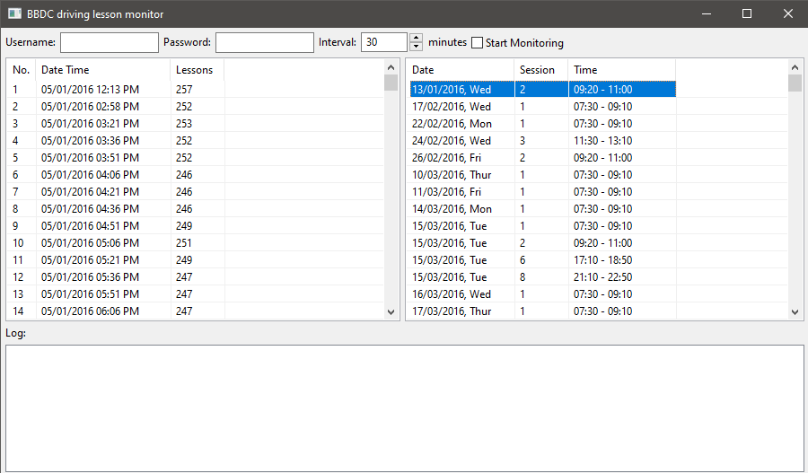

# Bukit Batok Driving Centre Lesson Monitor

## Introduction
Finding myself constantly refreshing the Bukit Batok Driving Centre web portal to find the next available closest schedules due to limited availability. 
I was motivated to create my own desktop application to constantly monitor for available slots. This is done with WxWidget UI Framework coupled with CURL, Htmlcxx & Poco to send web requests, parse the responses and 
storing them into XML formatted files.

## Screenshot

## Disclaimer
This project is strictly for educational purposes and for my own usage in 2016.
